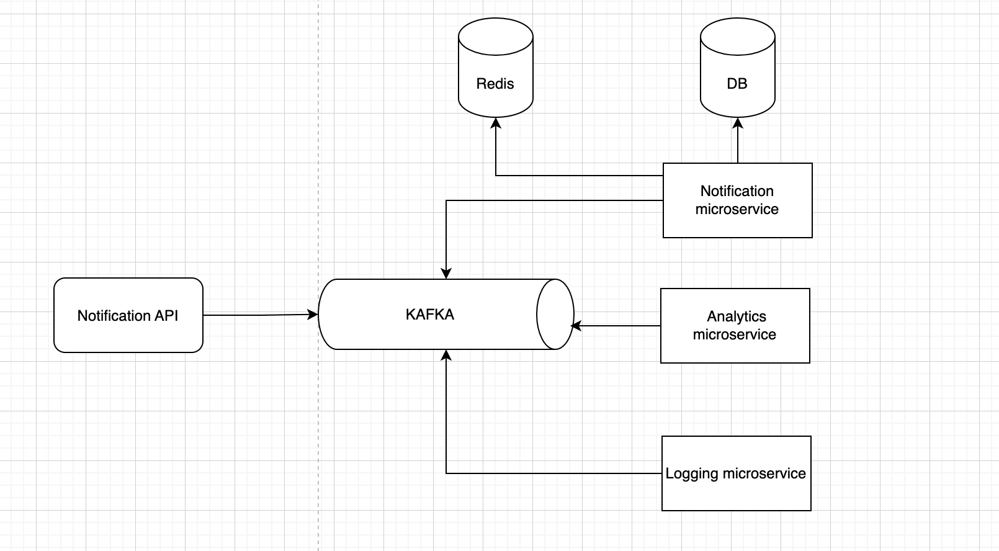

# Tron notification system

Welcome to Tron notification system.
A robust, scalable and secured api to send emails, SMS and push notifications.

```
Hi 👋, I'm Amily! I'm the author and developer of this notification system and more.
Drop me a message on my social links below. 
Hopefully we can know each other and maybe hangout, who knows 😄!
```


[Email](mailto:me@amilykassim02@gmail.com), 
[Github](https://github.com/amilykassim), 
[Twitter](https://twitter.com/amilykadyl)

This notification service is a distributed system consisted of an API and a microservice where each service can be developed independently in any language and more importantly scalable on it's own.

This notification system adopts an **asynchronous** communication pattern for internal services communication.
Here's why **asynchronous** is chosen over **synchronous** pattern in this notification system.

**_Synchronous communication_**

Synchronous communication like HTTP works well for small-scale systems, but its shortcomings become obvious as the scale increases. It creates a long request and response cycle that depends on many services. The drawbacks of this approach are:

- Low performance. If any one of the services in the chain doesn’t perform well, the whole system is impacted.

- Tight coupling. The request sender needs to know the recipient.

- Hard to scale. it’s not easy to scale the system to support a sudden increase in traffic.

**_Asynchronous communication_**

Here in asynchronous communication, each request (message) is processed by multiple services. Kafka works well here. When consumers receive messages, they are not removed from Kafka. The same message can be processed by different services. This model maps well to our notification system, as the same request might trigger multiple side effects such as sending push notifications, analytics, etc. An example is illustrated down below.



Generally speaking, synchronous communication is simpler in design, but it doesn’t allow services to be autonomous. Asynchronous communication trades design simplicity and consistency for scalability and failure resilience. For a large-scale system asynchronous communication is a better choice.

And since this is a distributed system communicating asynchronously it uses complimentary design patterns like CQRS, Event-driven architecture and Orchestration.

---

# Features

## Functional

- Email notifications
- SMS notifications
- Push notifications

## Non-Functional

- Reliability
- Fault tolerance
- Security
- Idempotent
- Rate limiter (Distributed denial of service attack (DDoS) prevention)

## Technologies
- NodeJS with NestJS framework
- Kafka
- Redis
- Postgres
- Docker

# Documentation

## Pre-requisites

- Docker

## Installing

- Install [Docker](https://docs.docker.com/get-docker/) if you dont have it installed.

## Getting Started

1. Git clone this repository && cd to the project directory

```
git clone https://github.com/amilykassim/tron-notification-api.git
```

## Run the project

#### Using VSCode or any of your favorite editor

P.S: Before starting up the containers make sure the following ports are not in use to avoid any conflict.

```
Ports: (6379, 29092, 5432, 3000, 4000)
```

Run `docker-compose up` to start notification api

Congratulations! You have successfully launched the App.

## Endpoints

### - User:

| Method | Endpoint           | Enable a user to:                              |
| ------ | ------------------ | ---------------------------------------------- |
| GET    | /                  | Check if notification system is up and running |
| POST   | /emails            | Send email                                     |
| POST   | /sms               | Send SMS                                       |
| POST   | /push-notification | Send push notification                         |

### - Admin:

| Method | Endpoint | Enable a user to:          |
| ------ | -------- | -------------------------- |
| GET    | /emails  | Get all blacklisted emails |

## Tests

To run the tests:

1.  Go to api directory `cd api`
2.  Replace envs in `.env` file with the envs of `.env.test` file
3.  Run `npm run test`

## Authors

- **Amily Kassim** (https://github.com/amilykassim)

## Licence

This software is published by `Amily Kassim` under the [MIT licence](http://opensource.org/licenses/MIT).
